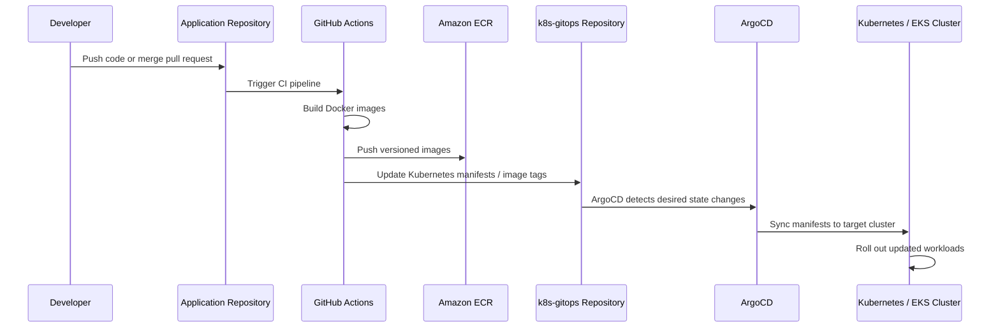
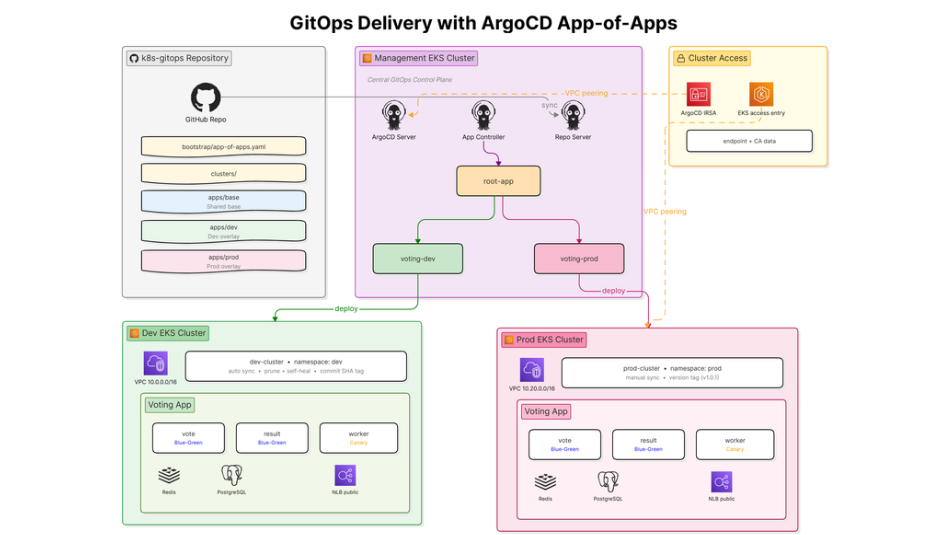

# Kubernetes GitOps Configuration Repository

This repository is the GitOps configuration repository for the AWS EKS GitOps Platform. It stores the declarative Kubernetes manifests, Kustomize overlays, cluster bootstrap resources, and ArgoCD application definitions used to deploy and manage workloads across Kubernetes environments.

In a GitOps workflow, this repository acts as the **single source of truth** for the desired state of the Kubernetes clusters. Application code and Docker image builds are handled in the main application/platform repository, while this repository focuses on Kubernetes deployment configuration and environment-specific state.

---

## Project Overview

This repository demonstrates how Kubernetes workloads can be managed using a GitOps-based delivery model with ArgoCD and Kustomize.

The main responsibilities of this repository include:

- Storing Kubernetes manifests for application workloads
- Managing environment-specific configurations
- Defining ArgoCD bootstrap resources
- Separating application source code from deployment configuration
- Supporting development and production deployment workflows
- Enabling automated synchronization from Git to Kubernetes clusters
- Providing a clear version history of deployment changes

This repository is designed to work together with the main AWS EKS platform repository, where Terraform provisions the cloud infrastructure and GitHub Actions builds container images before updating the manifests stored here.

---

## Role in the Platform

This repository represents the **CD/GitOps layer** of the platform.

The full platform is split into two main responsibilities:

| Repository                              | Responsibility                                                               |
| --------------------------------------- | ---------------------------------------------------------------------------- |
| Application / Infrastructure Repository | Builds container images, provisions AWS infrastructure, manages CI workflows |
| This GitOps Repository                  | Stores Kubernetes desired state and drives ArgoCD-based deployment           |

This separation reflects a common production DevOps pattern where source code, infrastructure code, and deployment configuration are managed independently but connected through automation.

---

## GitOps Workflow

The deployment process follows a pull-based GitOps model.



Instead of applying manifests manually with `kubectl`, all deployment changes are made through Git commits. ArgoCD continuously watches this repository and reconciles the cluster state with the desired state stored in Git.

---

## Repository Structure

```text
.
├── apps/
│   └── Application deployment manifests and Kustomize configurations
│
├── bootstrap/
│   └── Initial GitOps bootstrap resources used to register applications with ArgoCD
│
├── clusters/
│   └── Cluster-specific configuration for different Kubernetes environments
│
└── README.md
```

---

## Directory Responsibilities

### `apps/`

The `apps` directory contains Kubernetes application manifests and Kustomize configuration used to deploy workloads.

This directory is responsible for describing the application layer, such as:

- Deployments
- Services
- ConfigMaps
- Environment-specific overlays
- Image tag references
- Kustomize patches

In the GitOps workflow, GitHub Actions can update image tags in this directory after successfully building and pushing Docker images to Amazon ECR.

---

### `bootstrap/`

The `bootstrap` directory contains the initial resources required to connect the repository to ArgoCD.

This layer is responsible for bootstrapping GitOps management so that ArgoCD can start tracking the desired state defined in this repository.

Typical bootstrap resources may include:

- ArgoCD `Application` definitions
- App-of-apps configuration
- Initial cluster registration manifests
- Root application manifests

This makes it possible for ArgoCD to manage the rest of the deployment declaratively after the initial setup.

---

### `clusters/`

The `clusters` directory stores cluster-specific desired state.

This directory is useful when managing multiple environments, such as:

- Development cluster
- Production cluster
- Management cluster
- Environment-specific application versions
- Cluster-specific configuration patches

By separating cluster configuration from generic application manifests, the repository supports environment isolation and controlled promotion between environments.

---

## Technology Stack

| Area                     | Tools / Technologies      |
| ------------------------ | ------------------------- |
| Container Orchestration  | Kubernetes, Amazon EKS    |
| GitOps Controller        | ArgoCD                    |
| Configuration Management | Kustomize                 |
| Deployment Model         | Pull-based GitOps         |
| CI Integration           | GitHub Actions            |
| Container Registry       | Amazon ECR                |
| Manifest Format          | YAML                      |
| Environment Management   | Cluster-specific overlays |

---

## Architecture

The following diagram illustrates the GitOps deployment architecture, including the application repository, GitHub Actions pipeline, Amazon ECR, this GitOps repository, ArgoCD, and the target Kubernetes/EKS clusters.



The architecture follows a GitOps-driven deployment model, where ArgoCD continuously watches this repository as the source of truth and synchronizes the desired Kubernetes state to the development and production clusters.

````

---

## How Deployment Works

The deployment flow is designed to be automated and auditable.

1. A developer updates the application source code.
2. GitHub Actions builds Docker images.
3. Images are pushed to Amazon ECR.
4. The CI pipeline updates the Kubernetes image tag in this repository.
5. A new commit is pushed to the GitOps repository.
6. ArgoCD detects the change.
7. ArgoCD compares the desired state in Git with the live cluster state.
8. ArgoCD synchronizes the target Kubernetes cluster.
9. Kubernetes rolls out the updated workload.

This workflow keeps deployment history visible in Git and reduces the need for manual cluster operations.

---

## Why This Repository Matters

This repository is important because it represents the operational state of the Kubernetes platform.

By managing Kubernetes manifests through Git, the platform gains:

- Clear deployment history
- Easier rollback through Git commits
- Better separation between application code and deployment configuration
- Reduced manual `kubectl` operations
- Improved auditability
- Consistent deployments across environments
- ArgoCD-based drift detection and reconciliation

This follows the GitOps principle that Git should be the source of truth for the desired state of the system.

---

## Example GitOps Promotion Flow

A typical promotion flow can look like this:

```text
Developer changes application code
        ↓
GitHub Actions builds Docker image
        ↓
Image is pushed to Amazon ECR
        ↓
CI updates image tag in k8s-gitops
        ↓
ArgoCD detects Git change
        ↓
Development cluster syncs automatically
        ↓
Production deployment is promoted with a controlled version tag
````

For development, image tags may be based on Git commit SHA.

For production, image tags should use explicit release versions such as:

```text
v1.0.0
v1.1.0
v2.0.0
```

This creates a cleaner and safer release history.

---

## Operational Practices Demonstrated

This repository demonstrates several DevOps and platform engineering practices:

- GitOps-based Kubernetes deployment
- Declarative workload management
- Environment-specific configuration
- Separation of CI and CD responsibilities
- Kubernetes manifest versioning
- ArgoCD synchronization model
- Kustomize-based configuration customization
- Deployment traceability through Git history
- Multi-environment release management
- Pull-based delivery instead of manual deployment

---

## Key Skills Demonstrated

This project demonstrates hands-on experience in:

- Kubernetes workload deployment
- ArgoCD GitOps operations
- Kustomize overlays and manifest management
- Git-based deployment workflows
- CI/CD integration with GitOps repositories
- Environment separation for development and production
- Cloud-native release management
- EKS workload configuration
- YAML-based infrastructure and application configuration
- DevOps portfolio project organization

---

## Relationship With the Main Platform Repository

This repository is designed to work together with the main AWS EKS GitOps Platform repository.

The main platform repository is responsible for:

- Terraform infrastructure provisioning
- EKS cluster creation
- ECR repository creation
- GitHub Actions CI workflows
- Docker image build and push process
- ArgoCD installation and cluster registration

This repository is responsible for:

- Kubernetes desired state
- Application deployment manifests
- Cluster-specific GitOps configuration
- Kustomize overlays
- ArgoCD-tracked deployment state

Together, both repositories form a complete DevOps workflow from infrastructure provisioning to application delivery.

---

## Getting Started

Clone this repository:

```bash
git clone https://github.com/hgiang25/k8s-gitops.git
cd k8s-gitops
```

Review the repository structure:

```bash
tree
```

Check Kubernetes manifests:

```bash
find . -name "*.yaml" -o -name "*.yml"
```

If ArgoCD is already installed in the management cluster, apply the bootstrap manifests according to your platform setup:

```bash
kubectl apply -f bootstrap/
```

After bootstrapping, ArgoCD should manage the remaining desired state from this repository.

---

## Useful Commands

Check ArgoCD applications:

```bash
kubectl get applications -n argocd
```

Check workload status:

```bash
kubectl get pods -A
kubectl get svc -A
```

Check rollout status:

```bash
kubectl rollout status deployment/<deployment-name> -n <namespace>
```

Check Kustomize output before syncing:

```bash
kubectl kustomize <path-to-kustomize-directory>
```

Apply Kustomize manually for validation:

```bash
kubectl apply -k <path-to-kustomize-directory>
```

---

## Portfolio Notes

This repository is part of my DevOps portfolio and demonstrates the GitOps side of a cloud-native platform.

The purpose of this project is to show how Kubernetes deployments can be managed professionally using Git, ArgoCD, Kustomize, and environment-based configuration.

The project highlights my ability to design a deployment workflow that is:

- declarative,
- version-controlled,
- automated,
- environment-aware,
- auditable,
- and aligned with modern DevOps practices.

---

## Future Improvements

Possible improvements for this repository include:

- Add detailed architecture diagram
- Add environment-specific README files
- Add manifest validation in CI
- Add policy checks with Conftest, Kyverno, or OPA Gatekeeper
- Add automated YAML linting
- Add ArgoCD sync wave annotations
- Add rollback documentation
- Add application health check documentation
- Add production promotion strategy
- Add sealed secrets or External Secrets integration
- Add observability manifests for dashboards and alerts

---

## Author

**Hoàng Giang**
DevOps / Cloud / Kubernetes / GitOps Enthusiast

This repository is part of my personal DevOps portfolio, focusing on Kubernetes GitOps, ArgoCD, Kustomize, and cloud-native deployment automation.
